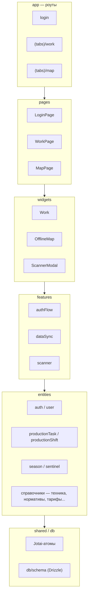

# AgroFlow (портфолио-образец)

Мобильное приложение-компаньон на React Native / Expo для агро-ERP платформы: полевые бригады
входят в систему, ведут производственные смены и задачи в офлайн-базе, синхронизируют данные
с бэкендом и просматривают спутниковые (NDVI) снимки на карте.

Этот репозиторий — обезличенная копия реального рабочего кода, опубликованная как код-сэмпл.
Название компании, API-эндпоинты, ключи и нативные проекты (`ios`/`android`) удалены или заменены
плейсхолдерами — запустить это против настоящего бэкенда как есть не получится.

**Это также намеренно урезанный срез оригинального приложения.** В реальном приложении около 20
`entities/` по одному и тому же слоистому паттерну (api/lib/repo) и ~27 `widgets/`, пять вкладок
(главная, работа, карта, профиль, плюс панель бота-ассистента). Для читаемости на собеседовании
этот срез обрезан до нескольких показательных примеров, которые всё ещё демонстрируют полный слой
`entities → features → widgets → pages → app`:

- **Login** (`entities/auth`, `entities/user`) — сквозной флоу авторизации, от сессии которого
  зависит каждый экран.
- **Вкладка Work** (`entities/productionTask`, `entities/productionShift`, плюс справочные данные,
  которые они используют — `agriculturalMachinery`, `techniqueStandard`, `workStandard`,
  `tariffsList`, `unitOfMeasure`, `productionWorkPlace`, `employee`, `dictionaries`,
  `techniqueMonitoring`) — флагманский офлайн-флоу: список задач на Drizzle/SQLite, детали/
  редактирование задачи и открытие/закрытие/синхронизация смены. В оригинальном приложении были
  ещё варианты для стационарных/транспортных задач по тому же паттерну, что и полевые задачи здесь;
  они убраны как почти дублирующие, а не оставлены ради полноты.
- **Вкладка Map** (`entities/season`, `entities/sentinel`) — более простая, ориентированная на
  чтение сущность (сезоны/поля) рядом с третьим отдельным паттерном: внешней гео-интеграцией,
  рисующей спутниковый/NDVI-слой поверх карты.

Убрано целиком: главная вкладка (новости, внутренние уведомления, панель бота-ассистента), вкладка
профиля (экраны зарплатного фонда и заработка) и их entities (`Notifications`, `assistant`,
`news`, `productionPlan`, `weather`) — ни одна из них не является несущей для флоу выше, поэтому их
потребители удалены вместе с ними, а не оставлены заглушками.

## Архитектура

Каждый слой зависит только от того, что находится ниже — стандартная дисциплина
Feature-Sliced Design.



Полностью рабочих сценария два:

- **Login → Work** — OAuth/PKCE-сессия, затем офлайн-список задач на Drizzle/SQLite, детали/
  редактирование задачи и открытие/закрытие/синхронизация смены со справочными данными (техника,
  нормативы, тарифы).
- **Login → Map** — выбор сезона/поля поверх спутникового NDVI-слоя через прокси
  `entities/sentinel` — другой архитектурный паттерн (внешняя гео-интеграция), в отличие от
  офлайн-синка у Work.

## Стек

- Expo Router, React Native, TypeScript
- Jotai для всего состояния (полностью — без React Context)
- Drizzle ORM поверх `expo-sqlite` для офлайн-хранилища
- Feature-Sliced Design: `app/`, `pages/`, `widgets/`, `features/`, `entities/`, `shared/`

## Структура

- `entities/` — доменные модели и их API/слой данных (производственные задачи, смены, справочники,
  спутниковые/sentinel-данные и т.д.), каждая с публичным API через `index.ts`-барель. Какие
  сущности остались и почему — см. заметку про обрезку выше.
- `features/` — пользовательские сценарии, собранные из entities (офлайн-синхронизация данных,
  синхронизация справочников, сканирование и т.д.).
- `widgets/` — крупные составные UI-блоки (карта, экраны работы с задачами/сменами).
- `pages/` — экраны уровня роута, которые рендерит `app/` (Expo Router): вход, работа, карта.
- `shared/` — сквозные утилиты, UI-примитивы и хуки.
- `db/` — локальная SQLite-схема и клиент (Drizzle).

## Локальный запуск

Скопируйте `.env.example` в `.env.development` и заполните плейсхолдеры значениями своего
бэкенда — реальные эндпоинты и ключи из продакшена в репозиторий не включены.

```bash
npm install
npm run start
```

## Проверки

```bash
npm run typecheck
npm test
```
